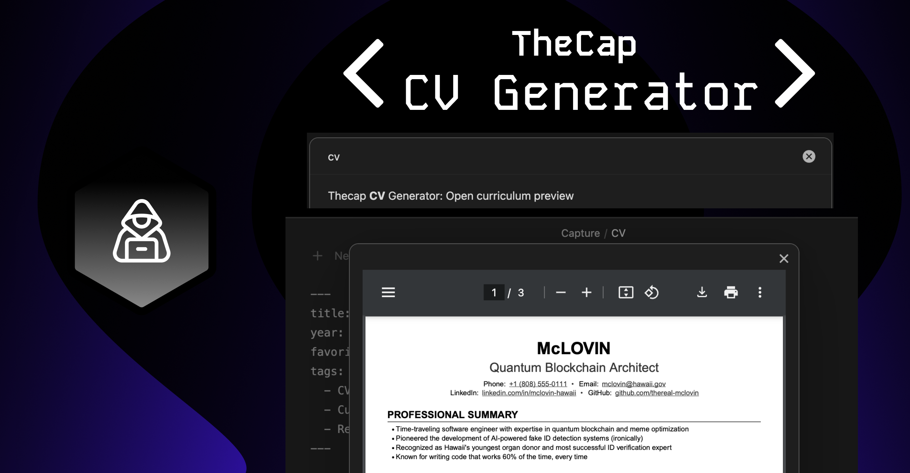

# TheCAP CV Generator - Obsidian Plugin

An Obsidian plugin for CV/Resume generation that's part of the Thecap CV Generator monorepo. This plugin allows you to generate a PDF version of your CV directly within your Obsidian vault.

<br>

## Features

- Create and edit CVs using markdown format
- Preview your CV in PDF.
- Consistent formatting with the web version.

## Usage

There are two ways to open the curriculum preview:

1. **Ribbon Icon**: Click the PDF file icon (📄) in the left sidebar ribbon to "Preview curriculum"
2. **Command Palette**: Open the command palette (Cmd/Ctrl + P) and search for "Open curriculum preview"

## Notation Guide

Use the following markdown notation to structure your curriculum:

| Notation | Description | Example |
|----------|-------------|----------|
| `# Name` | Your name followed by contact details | `# John Doe` |
| `- key: value` | Contact details (under name) | `- email: john@example.com` |
| `## Section` | Main section | `## Experience` |
| `## Section \break` | Section with page break after | `## Education \break` |
| `### Primary Title \| Right Text` | Item with title and optional right-aligned text | `### Software Engineer \| 2020-Present` |
| `### Primary Title \break` | Item with page break after | `### Project Lead \break` |
| `#### Secondary Title \| Right Text` | Subtitle with optional right-aligned text | `#### Team Lead \| New York` |
| `- Detail` | Bullet point details | `- Led team of 5 developers` |

### Example:

The CV follows a specific markdown format. For detailed information about the format, please refer to the [main repository README](../../README.md#markdown-format).

Quick example:
```markdown
---
title: My CV
year: 2024
---
# John Doe
- title: Software Engineer
- Email: john@example.com
- Location: New York, NY

## PROFESSIONAL EXPERIENCE
### Company Name | Location
#### Position | 2020 - Present
- Achievement 1
- Achievement 2
```

## License

This project is licensed under the GNU General Public License v3.0 (GPL-3.0) - see the [LICENSE](../../LICENSE) file for details.

What this means:
- ✔️ You can use this software for commercial purposes
- ✔️ You can modify the source code
- ✔️ You can distribute modified versions
- ❗ You must keep the source code open source
- ❗ You must state changes made to the code
- ❗ You must disclose your source code
- ❗ You must use the same license (GPL-3.0)
